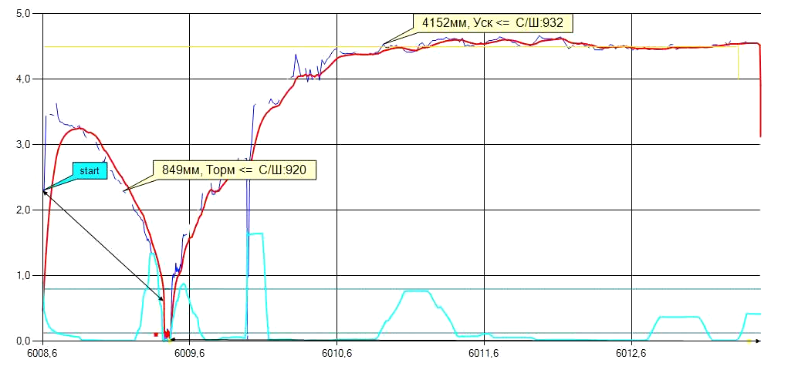
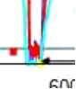
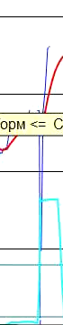

# IntelMetTask

К заданию прилагается файл в JSON формате с результатами измерения.
В коллекции Distances содержаться результаты измерения скорости объекта. Скорость свойство Speed, пройденное расстояние свойство Distance.

На графике видно, что измеряемый объект на скорости `3.5 м/c` въехал под измеритель. Потом плавно снизил скорость до `0`. Далее прибор дал легкие шумы. После чего объект разогнался до скорости `4.2 м/c` и измерение завершилось.
График построен на примере файла `SlabMeasure0132981.json`.

Задача. Написать программу, которая выведет области измерения объекта без шумов. На графике области измерения выделены четными стрелками.

В область измерения не должны попасть шумы.

Измерение может вызывать кратковременные провалы. Их нужно игнорировать.

